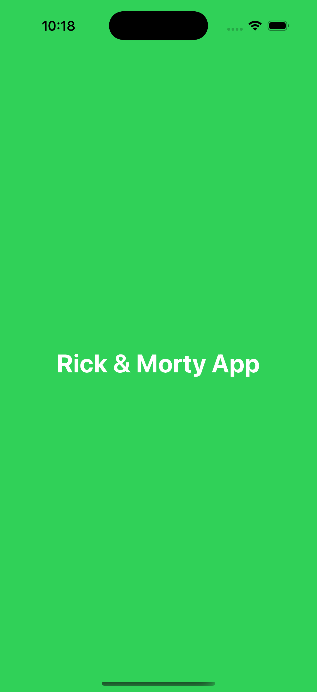
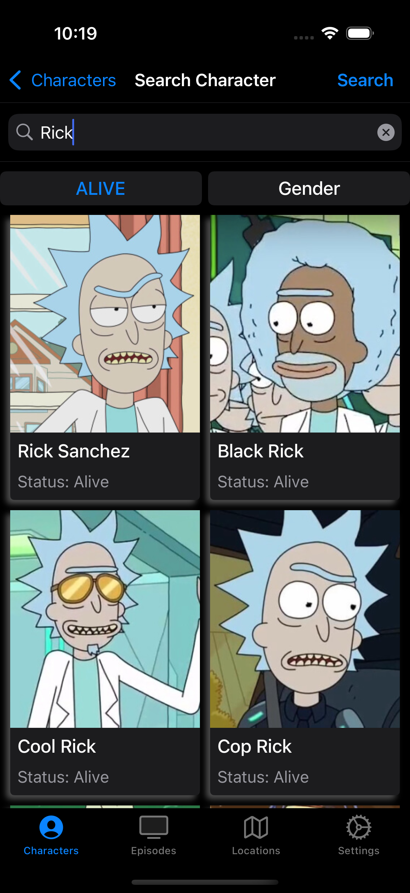
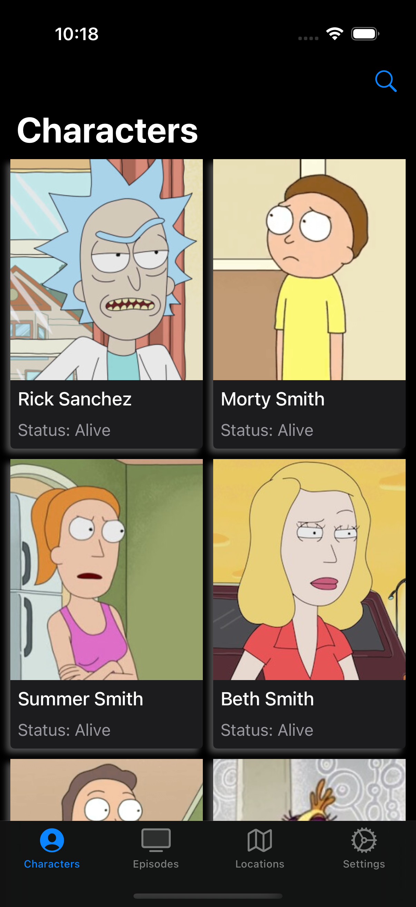
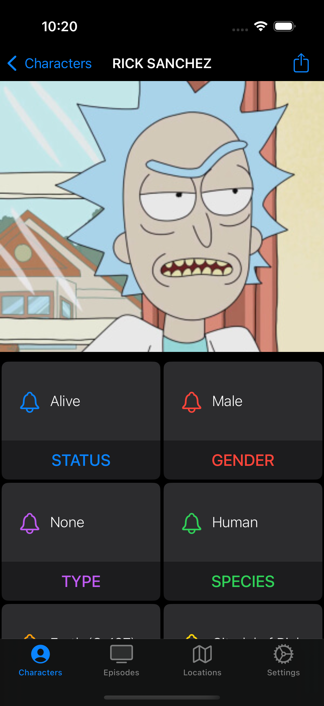
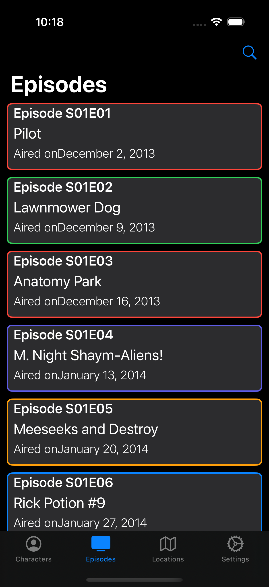
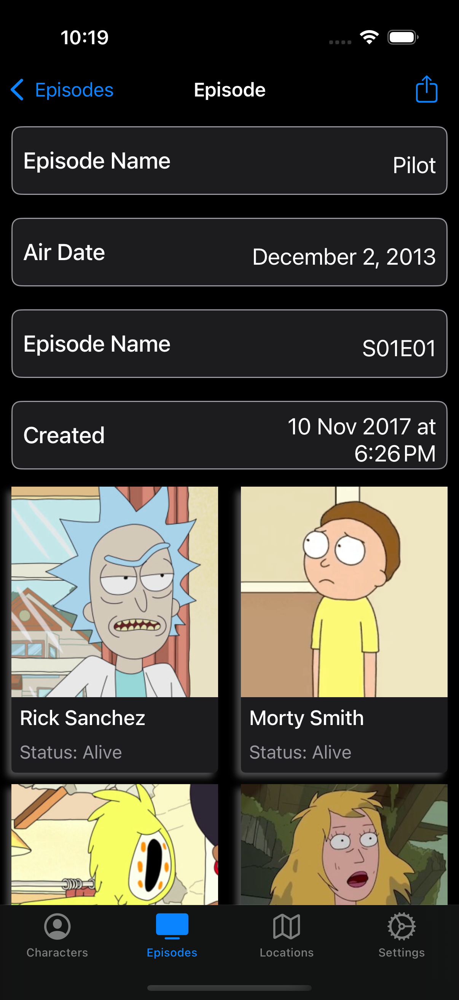
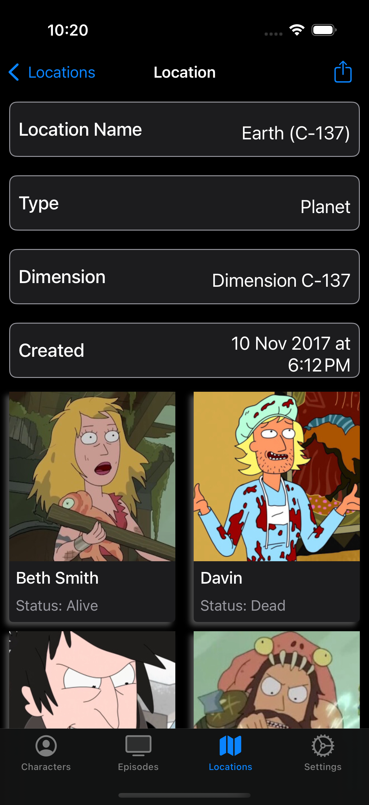
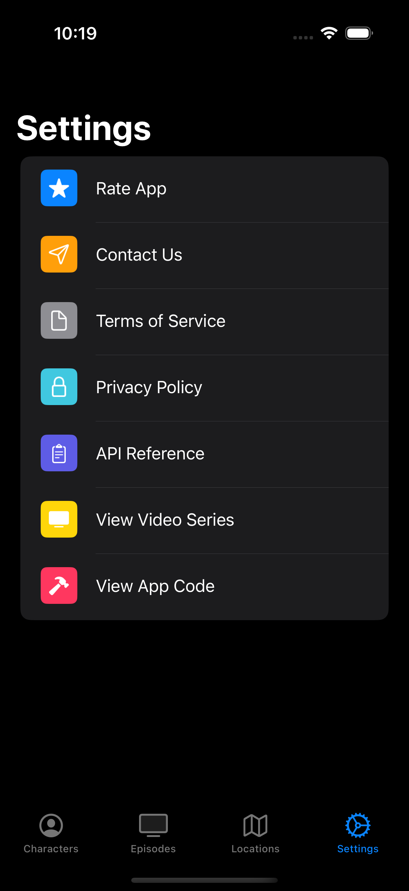

# Rick and Morty iOS Client

A production-quality **iOS application built in Swift** that consumes the public  
[Rick and Morty REST API](https://rickandmortyapi.com/) to display characters, episodes, and locations from the series.

The project is architected using **MVVM**, leverages **UIKit** for the core UI. 
It demonstrates scalable app structure, clean networking abstractions, caching strategies, and modern iOS development practices.

---

## 📱 App Overview

The Rick and Morty iOS Client allows users to explore the entire Rick and Morty universe through a clean, intuitive interface.  
Users can browse, search, and paginate through characters, episodes, and locations, while benefiting from cached network responses and optimized image loading.

Navigation is handled via a **tab bar–based interface**, with dedicated screens for each domain entity.

---

## ✨ Key Features

- 👤 **Character Browser**  
  Browse and paginate through all characters with detailed profile views.

- 📺 **Episode & Location Listings**  
  Explore episodes and locations with rich metadata and structured detail screens.

- 🔍 **Search Functionality**  
  Search across characters, episodes, and locations using API-backed filtering.

- 📄 **Pagination Support**  
  Incrementally load additional content for improved performance and UX.

- 🧠 **MVVM Architecture**  
  Clean separation of concerns between views, view models, and models.

- 🖼️ **Caching & Image Loading**  
  Optimized performance via API response caching and image caching.

---

## Screenshots

<table align="center">
  <tr>
    <td align="center">
       
      <b>Launch Screen</b>
    </td>
    <td align="center">
       
      <b>Search Screen</b>
    </td>
  </tr>
  <tr>
    <td align="center">
       
      <b>Character List Screen</b>
    </td>
    <td align="center">
       
      <b>Character Detail Screen</b>
    </td>
  </tr>
  <tr>
    <td align="center">
       
      <b>Episode List Screen</b>
    </td>
    <td align="center">
       
      <b>Episode Detail Screen</b>
    </td>
  </tr>
</table>
<tr>
    <td align="center">
       
      <b>Location List Screen</b>
    </td>
    <td align="center">
       
      <b>Location Detail Screen</b>
    </td>
  </tr>

  <tr>
    <td align="center">
       
      <b>Settings Screen</b>
    </td>
  </tr>
</table>

## 🏗️ Architecture & Design

- **Architecture Pattern:** MVVM (Model–View–ViewModel)
- **UI Framework:** UIKit (with selective SwiftUI usage)
- **Networking:** URLSession with a reusable request/service layer
- **Caching:**  
  - `RMAPICacheManager` for API responses  
  - `RMImageLoader` for image caching
- **Dependency Management:** Native Xcode tooling (no third-party frameworks)

This architecture ensures:
- High testability
- Clear separation of responsibilities
- Scalability for future feature expansion

---

## 🛠️ Tech Stack & Requirements

- **Language:** Swift  
- **UI Framework:** UIKit (with selective SwiftUI integration)  
- **Networking:** URLSession  
- **Architecture:** MVVM  
- **Minimum iOS Version:** iOS 15.0+  
- **Xcode:** 14.0+  
- **macOS:** 12.0+  

---

